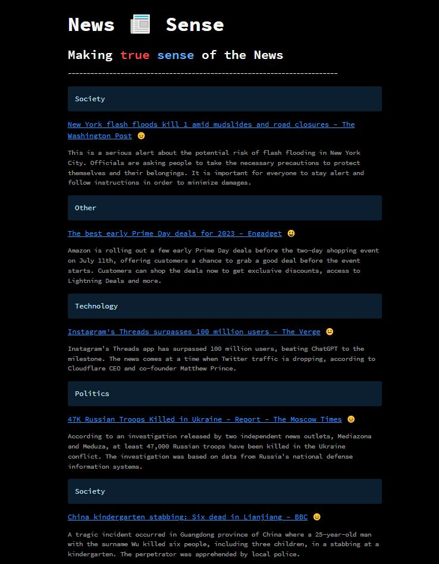

# News Sense
### A Streamlit app based on Python that fetches top news articles from the News API, generates a summary of each article using the OpenAI GPT-3 model, analyzes the sentiment of the article using the NLTK library, and classifies the article into different categories based on keywords.

## Setup
Before running the script, make sure you have the following dependencies installed:
- `requests`: To make HTTP requests to the News API.
- `openai`: To interact with the OpenAI GPT-3 model.
- `nltk`: To perform sentiment analysis using the VADER lexicon.

You can install the dependencies using the following command:
```
pip: -r requirements.txt
```

Additionally, you need to download the VADER lexicon by running the following code once:
```python
import nltk
nltk.download('vader_lexicon')
```

## API Keys
To use the script, you need to provide your API keys for the News API and the OpenAI GPT-3 API. Replace the placeholder values with your actual API keys in the `secrets.toml` file:
```python
NEWS_API_KEY = ""
CHATGPT_API_KEY = "sk-"
```

## Functionality
The script provides the following functions:
- `get_news_articles()`: Fetches the top news articles from the News API. It returns a list of articles.
- `generate_summary(text)`: Generates a summary of the given text using the OpenAI GPT-3 model. It returns the generated summary.
- `analyze_sentiment(text)`: Analyzes the sentiment of the given text using the VADER lexicon from NLTK. It returns a dictionary of sentiment scores.
- `classify_article(text)`: Classifies the article into different categories based on keywords present in the text. It returns a list of categories.
- `main()`: The main function that fetches news articles, generates summaries, analyzes sentiments, and classifies articles. It prints the title, URL, summary, sentiment, and categories for each article.

## Usage
To use the script, simply run the following command:
```
streamlit run getNewsSense.py
```
The script will fetch the top news articles, generate summaries, analyze sentiments, and classify articles. The results will be printed for each article. The script uses the `davinci` engine from the OpenAI GPT-3 model. Make sure you have sufficient credits or subscription to use the model effectively.

## Screenshot


## License
[MIT License](https://github.com/tanmaychk/news-sense/blob/main/LICENSE)
